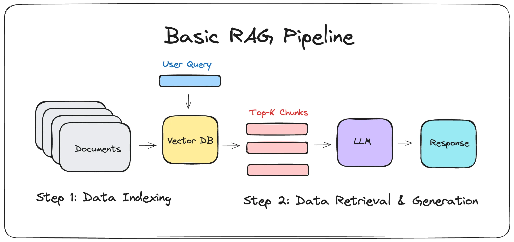

# RAG_learning
Learning RAG and vector databases

# How RAG works(Retrieval-Augmented Generation)

# **Vector Database and ANN Search**

## **What is a Vector Database?**  
A **vector database** is a specialized database designed to store and retrieve high-dimensional vectors efficiently. These vectors typically represent objects like images, text embeddings, audio, or any data that can be converted into numerical vectors using machine learning models.  

Unlike traditional relational databases that rely on exact matching (e.g., SQL queries), vector databases use similarity search techniques, making them ideal for tasks like:  
- Image and video search  
- Recommendation systems  
- Natural language processing (e.g., semantic search)  
- Anomaly detection  

## **How Do We Search in a Vector Database Using ANN?**  
Vector databases support **Approximate Nearest Neighbor (ANN) search**, which efficiently finds the closest vectors to a given query vector without scanning the entire dataset. ANN is preferred over exact nearest neighbor (NN) search for large-scale datasets because it balances **speed and accuracy**.  

### **Steps for ANN-based Search in a Vector Database**  

1. **Vectorization**  
   - Convert the data (e.g., images, text, audio) into **high-dimensional vectors** using models like OpenAI’s CLIP (for images and text) or Word2Vec/BERT (for NLP tasks).  

2. **Indexing**  
   - The vector database organizes and indexes the vectors for fast retrieval. Common indexing techniques include:  
     - **FAISS (Facebook AI Similarity Search)** – Uses clustering and compression for fast retrieval.  
     - **HNSW (Hierarchical Navigable Small World Graphs)** – A graph-based approach offering efficient search.  
     - **IVF (Inverted File Index)** – Divides vectors into clusters to reduce the search space.  

3. **Querying**  
   - Given a query vector, the database **performs ANN search** to find similar vectors using similarity metrics like:  
     - **Cosine similarity** – Measures angle-based similarity between vectors.  
     - **Euclidean distance** – Measures direct distance in vector space.  
     - **Dot product** – Used in some ML models for similarity measurement.  

4. **Retrieval & Ranking**  
   - The best-matching vectors are returned, ranked by their similarity score. Further filtering and re-ranking can be applied.  

## **Popular Vector Databases Supporting ANN Search**  
- **FAISS** (by Meta) – Highly optimized for large-scale similarity search.  
- **Milvus** – Open-source, scalable, and widely used for AI applications.  
- **Pinecone** – Fully managed, cloud-based vector database.  
- **Weaviate** – AI-native, supports hybrid search (text + vectors).  
- **Annoy** (by Spotify) – Used for fast approximate nearest neighbor search.  
- **Chroma** – Simple, developer-friendly, and optimized for LLM applications.